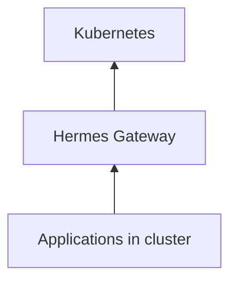

# Hermes

**The application operating layer for Kubernetes.**

**Every Application. One Door.**

Hermes transforms Kubernetes from an infrastructure platform into an application platform — auto-discovering every dashboard, API, and internal tool, then giving users a permanent front door to launch software without `kubectl port-forward`.

```text
┌──────────────────────────────────────────────────────────────┐
│  Experience   Launchpad · App catalog · Health · Gateway     │
├──────────────────────────────────────────────────────────────┤
│  Discovery    Continuous cluster scan · annotation-aware     │
├──────────────────────────────────────────────────────────────┤
│  Platform     Zeus OS application layer · Helm · Go/Rust   │
└──────────────────────────────────────────────────────────────┘
```

---

## Why Hermes

| Problem | Hermek answer |
|---------|---------------|
| "Where is Grafana?" every Monday | Living app catalog with one-click launch |
| Bookmark sprawl and tribal knowledge | Permanent URLs — cluster self-documents |
| Port-forward culture | Gateway front door to every workload |
| Infrastructure UX ≠ human UX | macOS Launchpad mental model for K8s |
| Apps exist but aren't discoverable | Continuous discovery across namespaces |

**Not** a dashboard. **Not** an ingress controller. **The** application memory for your clusters.

---

## Platform at a Glance

| Layer | What's in the repo |
|-------|-------------------|
| **Controller** | Go discovery + gateway — `controller/`, `cmd/` |
| **API** | Rust API layer — `crates/`, `api/` |
| **UI** | React application experience — `ui/` |
| **Charts** | Helm install — `charts/hermes/` |
| **Deploy** | Remote k3s scripts — `scripts/` |

---

## Quick Start

```bash
git clone https://github.com/ssahani/hermes.git && cd hermes

# Helm install
helm install hermes ./charts/hermes   -n hermes-system --create-namespace   --set global.domain=zeus.local

# Remote lab deploy
make deploy-remote
./scripts/test-zyvor-stack-remote.sh 212.8.252.194 30151 sus

# Local dev
make build && ./scripts/smoke-test.sh
# → http://localhost:31847
```

| Scenario | Path |
|----------|------|
| Architecture | [docs/architecture.md](docs/architecture.md) |
| Install guide | [docs/install.md](docs/install.md) |
| UI behavior | [docs/ui.md](docs/ui.md) |
| Annotations | [docs/annotations.md](docs/annotations.md) |

---

## Architecture



Humans ask: *Where is Grafana? Is it healthy? Can I open it?*  
Hermes answers — without namespace archaeology.

---

## Documentation

| Goal | Document |
|------|----------|
| Docs index | [docs/README.md](docs/README.md) |
| User stories | [docs/USER_STORIES.md](docs/USER_STORIES.md) |
| Full README deep dive | See git history or product specs in repo |

## Zyvor Platform Stack

| Product | Role |
|---------|------|
| **hypercluster** | Bare-metal Kubernetes bootstrap |
| **machina** | Physical hypervisor OS (libvirt/KVM) |
| **zeus-os** | Cloud / KubeVirt control plane |
| **hermes** | Application layer for Kubernetes |
| **forge** | AI infrastructure on Kubernetes |
| **hypersdk / hyper2kvm** | Multi-cloud VM migration |
| **guestkit** | Offline VM migration assurance |
| **packetwolf** | Kernel-native network intelligence |
| **Aether** | Universal runtime portability |
| **Veyron** | KubeVirt VM command center |
| **IronWolf** | Metal3 bare-metal automation |
| **zyvor-fabric** | systemd-native private cloud |

→ [zyvor.dev](https://zyvor.dev)

---

## Development

See project docs for CI, testing, and contribution guidelines. Historical build summaries in the repo root are snapshots — **`docs/` and this README are authoritative.**

---

## License

See [LICENSE](LICENSE) or project-specific licensing files in `docs/legal/`.
