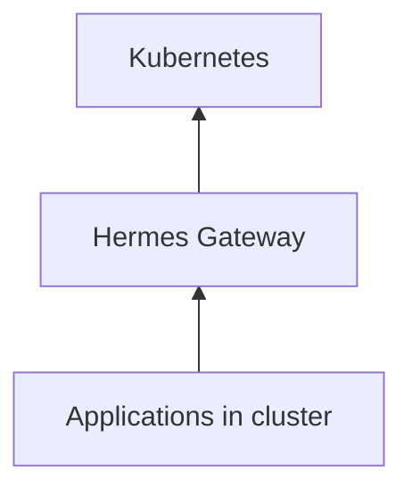

# Hermes

**The application operating layer for Kubernetes.**

**Every Application. One Door.**

Hermes transforms Kubernetes from an infrastructure platform into an application platform — auto-discovering every dashboard, API, and internal tool, then giving users a permanent front door to launch software without `kubectl port-forward`.

```text
┌──────────────────────────────────────────────────────────────┐
│  Experience   Launchpad · App catalog · Health · Gateway     │
├──────────────────────────────────────────────────────────────┤
│  Discovery    Continuous cluster scan · annotation-aware     │
├──────────────────────────────────────────────────────────────┤
│  Zeus AI      Fleet insight · Spotlight NL · diagnose flows  │
├──────────────────────────────────────────────────────────────┤
│  Platform     Zeus OS application layer · Helm · Go/Rust   │
└──────────────────────────────────────────────────────────────┘
```

---

## Why Hermes

| Problem | Hermes answer |
|---------|---------------|
| "Where is Grafana?" every Monday | Living app catalog with one-click launch |
| Bookmark sprawl and tribal knowledge | Permanent URLs — cluster self-documents |
| Port-forward culture | Gateway front door to every workload |
| Infrastructure UX ≠ human UX | macOS Launchpad mental model for K8s |
| Apps exist but aren't discoverable | Continuous discovery across namespaces |
| Raw probe errors and namespace archaeology | Zeus AI explains fleet health in plain language |

**Not** a dashboard. **Not** an ingress controller. **The** application memory for your clusters.

---

## Platform at a Glance

| Layer | What's in the repo |
|-------|-------------------|
| **Controller** | Go discovery + gateway — `controller/`, `cmd/` |
| **API** | Rust API layer — `crates/`, `api/` |
| **UI** | React Nebula launchpad — `ui/` |
| **Zeus AI** | Insight APIs + Spotlight NL search — `crates/hermes-core/src/insight.rs`, `docs/ui.md` |
| **Charts** | Helm install — `charts/hermes/` |
| **Deploy** | Remote k3s scripts — `scripts/` |

---

## Quick Start

```bash
git clone https://github.com/ssahani/hermes.git && cd hermes

# Helm install
helm install hermes ./charts/hermes \
  -n hermes-system --create-namespace \
  --set global.domain=zeus.local

# Remote lab deploy
make deploy-remote
./scripts/test-zyvor-stack-remote.sh 212.8.252.194 30151 sus

# Local dev
make build && ./scripts/smoke-test.sh
# → http://localhost:31847
```

Optional LLM for Zeus AI (rule-based fallback works without a key):

```bash
export HERMES_LLM_API_URL=https://api.openai.com/v1
export HERMES_LLM_API_KEY=sk-...
./scripts/deploy-remote.sh <host> <user>
# Or local Ollama: ./scripts/setup-ollama-remote.sh <host> <user>
```

| Scenario | Path |
|----------|------|
| Architecture | [docs/architecture.md](docs/architecture.md) |
| Install guide | [docs/install.md](docs/install.md) |
| UI & Zeus AI | [docs/ui.md](docs/ui.md) |
| Annotations | [docs/annotations.md](docs/annotations.md) |
| User stories | [docs/USER_STORIES.md](docs/USER_STORIES.md) |

---

## Architecture



Humans ask: *Where is Grafana? Is it healthy? Can I open it?*  
Hermes answers — without namespace archaeology.

---

## Documentation

| Goal | Document |
|------|----------|
| Docs index | [docs/README.md](docs/README.md) |
| User stories & validation | [docs/USER_STORIES.md](docs/USER_STORIES.md) |
| Full product deep dive | [docs/FULL_README_LEGACY.md](docs/FULL_README_LEGACY.md) |
| Contributing | [CONTRIBUTING.md](CONTRIBUTING.md) |
| Changelog | [CHANGELOG.md](CHANGELOG.md) |

## Zyvor Platform Stack

| Product | Role |
|---------|------|
| **hypercluster** | Bare-metal Kubernetes bootstrap |
| **machina** | Physical hypervisor OS (libvirt/KVM) |
| **zeus-os** | Cloud / KubeVirt control plane |
| **hermes** | Application layer for Kubernetes |
| **forge** | AI infrastructure on Kubernetes |
| **hypersdk / hyper2kvm** | Multi-cloud VM migration |
| **guestkit** | Offline VM migration assurance |
| **packetwolf** | Kernel-native network intelligence |
| **Aether** | Universal runtime portability |
| **Veyron** | KubeVirt VM command center |
| **IronWolf** | Metal3 bare-metal automation |
| **zyvor-fabric** | systemd-native private cloud |

→ [zyvor.dev](https://zyvor.dev)

---

## Development

See [CONTRIBUTING.md](CONTRIBUTING.md) for build, test, and CI workflows. **`docs/` and this README are authoritative** for current behavior.

---

## License

Copyright (c) 2026 ZyvorAI Labs Private Limited. See [LICENSE](LICENSE).
