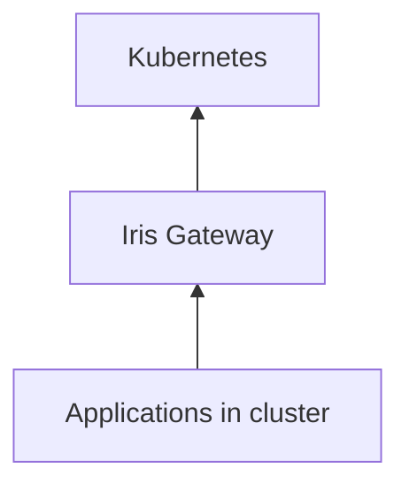

# Iris

[](LICENSE)

**The application operating layer for Kubernetes.**


## 📖 Feature Guide

**[Iris — Customer Feature Guide](docs/iris-customer-feature-guide.md)** — a complete, customer-facing reference covering all **60 features** across **12 areas**, grounded in the product's actual capabilities. Also available as a print-ready **[PDF](docs/iris-customer-feature-guide.pdf)**.

**[Customer manual (page-by-page)](docs/customer/README.md)** — getting started, admin basics, and a guide for every product surface (PDFs under `docs/customer/pdf/`).

**Every Application. One Door.**

Iris transforms Kubernetes from an infrastructure platform into an application platform — auto-discovering every dashboard, API, and internal tool, then giving users a permanent front door to launch software without `kubectl port-forward`.

```text
┌──────────────────────────────────────────────────────────────┐
│  Experience   Launchpad · App catalog · Health · Gateway     │
├──────────────────────────────────────────────────────────────┤
│  Discovery    Continuous cluster scan · annotation-aware     │
├──────────────────────────────────────────────────────────────┤
│  Zyra AI      Fleet insight · Spotlight NL · diagnose flows  │
├──────────────────────────────────────────────────────────────┤
│  Platform     Zeus OS application layer · Helm · Go/Rust   │
└──────────────────────────────────────────────────────────────┘
```

---

## Why Iris

| Problem | Iris answer |
|---------|---------------|
| "Where is Grafana?" every Monday | Living app catalog with one-click launch |
| Bookmark sprawl and tribal knowledge | Permanent URLs — cluster self-documents |
| Port-forward culture | Gateway front door to every workload |
| Infrastructure UX ≠ human UX | macOS Launchpad mental model for K8s |
| Apps exist but aren't discoverable | Continuous discovery across namespaces |
| Raw probe errors and namespace archaeology | Zyra AI explains fleet health in plain language |

**Not** a dashboard. **Not** an ingress controller. **The** application memory for your clusters.

---

## Platform at a Glance

| Layer | What's in the repo |
|-------|-------------------|
| **Controller** | Go discovery + gateway — `controller/`, `cmd/` |
| **API** | Rust REST + gateway — `crates/iris-api`, `crates/iris-gateway` |
| **UI** | React Nebula launchpad — `ui/` |
| **Zyra AI** | Insight APIs + Spotlight NL search — `crates/iris-core/src/insight.rs`, `docs/ui.md` |
| **Charts** | Helm install — `charts/iris/` |
| **Deploy** | Remote k3s scripts — `scripts/` |

---

## Quick Start

```bash
git clone https://github.com/zyvorai/iris.git && cd iris

# Install from GHCR (chart + images)
helm install iris oci://ghcr.io/zyvorai/charts/iris \
  --version 0.2.0 \
  --namespace iris-system --create-namespace \
  --set controller.publicBaseUrl=https://<node-ip>:31847

# Or build from source and use the local chart
make build
helm install iris ./charts/iris \
  -n iris-system --create-namespace \
  --set global.domain=iris.local \
  --set controller.publicBaseUrl=https://<node-ip>:31847 \
  --set image.controller.repository=iris-controller \
  --set image.server.repository=iris-server \
  --set image.controller.pullPolicy=Never \
  --set image.server.pullPolicy=Never

# Remote k3s deploy (builds images on the target host)
./scripts/deploy-remote.sh <host> <user>

# Local smoke
./scripts/smoke-test.sh
# → https://localhost:31847
```

Optional LLM for Zyra AI (rule-based fallback works without a key):

```bash
export IRIS_LLM_API_URL=https://api.openai.com/v1
export IRIS_LLM_API_KEY=sk-...
./scripts/deploy-remote.sh <host> <user>
# Or local Ollama: ./scripts/setup-ollama-remote.sh <host> <user>
```

| Scenario | Path |
|----------|------|
| **Developer guide** | [docs/development.md](docs/development.md) |
| **API reference** | [docs/api.md](docs/api.md) |
| Architecture | [docs/architecture.md](docs/architecture.md) |
| Install guide | [docs/install.md](docs/install.md) |
| UI & Zyra AI | [docs/ui.md](docs/ui.md) |
| Annotations | [docs/annotations.md](docs/annotations.md) |
| User stories | [docs/USER_STORIES.md](docs/USER_STORIES.md) |

---

## Architecture



Humans ask: *Where is Grafana? Is it healthy? Can I open it?*  
Iris answers — without namespace archaeology.

---

## Documentation

| Goal | Document |
|------|----------|
| Docs index | [docs/README.md](docs/README.md) |
| **Developer guide** | [docs/development.md](docs/development.md) |
| **API reference** | [docs/api.md](docs/api.md) |
| User stories & validation | [docs/USER_STORIES.md](docs/USER_STORIES.md) |
| Full product deep dive | [docs/FULL_README_LEGACY.md](docs/FULL_README_LEGACY.md) |
| Contributing | [CONTRIBUTING.md](CONTRIBUTING.md) |
| Security | [SECURITY.md](SECURITY.md) |
| Code of Conduct | [CODE_OF_CONDUCT.md](CODE_OF_CONDUCT.md) |
| Changelog | [CHANGELOG.md](CHANGELOG.md) |

## Zyvor Platform Stack

| Product | Role |
|---------|------|
| **hypercluster** | Bare-metal Kubernetes bootstrap |
| **machina** | Physical hypervisor OS (libvirt/KVM) |
| **zeus-os** | Cloud / KubeVirt control plane |
| **iris** | Application layer for Kubernetes |
| **forge** | AI infrastructure on Kubernetes |
| **transiva / h2kvm** | Multi-cloud VM migration |
| **guestkit** | Offline VM migration assurance |
| **packetwolf** | Kernel-native network intelligence |
| **Axiom** | Universal runtime portability |
| **Veyron** | KubeVirt VM command center |
| **IronWolf** | Metal3 bare-metal automation |
| **zyvor-fabric** | systemd-native private cloud |

→ [zyvor.dev](https://zyvor.dev)

---

## Development

See [CONTRIBUTING.md](CONTRIBUTING.md) for build, test, and CI workflows. **`docs/` and this README are authoritative** for current behavior.

---

## License

Licensed under the [Apache License, Version 2.0](LICENSE).
Copyright 2026 ZyvorAI Labs Private Limited. See [NOTICE](NOTICE).
