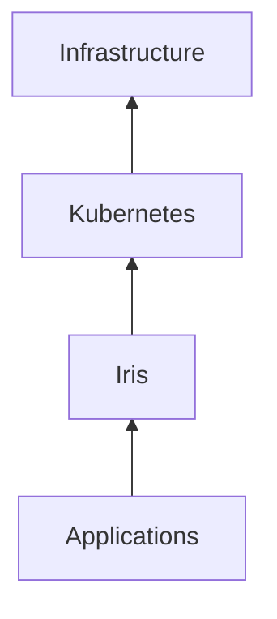
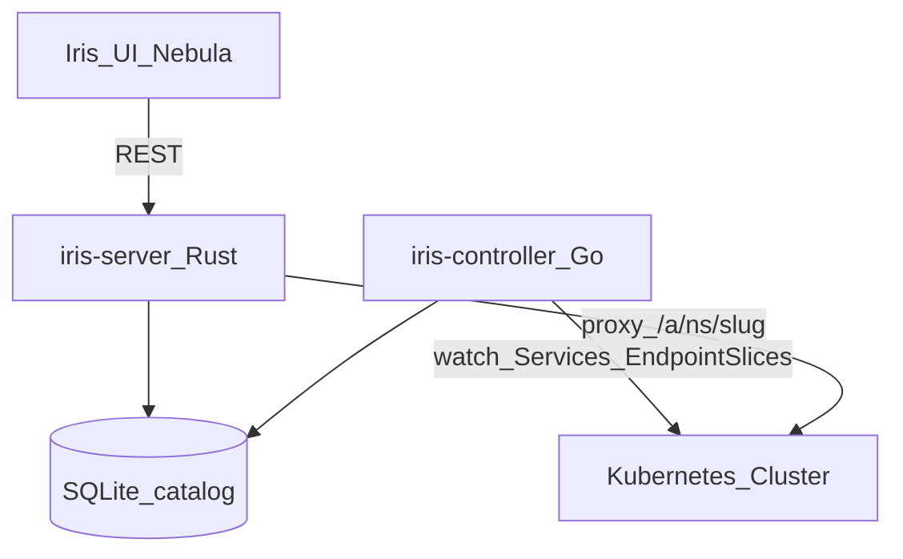

# Iris

### The Application Operating Layer for Kubernetes

**Every Application. One Door.**

Iris transforms Kubernetes from an infrastructure platform into an application platform.

It automatically discovers applications running anywhere in your cluster, understands what they are, monitors their health, organizes them into a beautiful application experience, and provides a permanent front door to every workload.

Discovering, organizing, securing, and launching every application running across your clusters through a single intelligent gateway.

Think macOS Launchpad for Kubernetes. Spotlight for infrastructure. Raycast for clusters. Application memory for platforms.

---

## The Problem

Modern Kubernetes environments are operationally successful but experientially broken.

A typical enterprise cluster contains hundreds of services, dozens of namespaces, multiple ingress controllers, internal APIs, monitoring systems, CI/CD platforms, and developer tools. The infrastructure knows where everything is. Humans do not.

Teams waste time asking:

- Where is Grafana?
- What is the URL for Harbor?
- Which namespace runs Jenkins?
- Which service owns this dashboard?
- Is this application healthy?
- Why do I need `kubectl` just to open a tool?

Instead of remembering:

```text
grafana.monitoring.svc.cluster.local
argocd-server.argocd.svc.cluster.local
10.44.0.21:8080
```

Users should simply see:

```text
Grafana
Argo CD
Prometheus
Harbor
Backstage
Jenkins
```

Click. Launch. Done.

Iris eliminates tribal knowledge, bookmark sprawl, and port-forward culture. The cluster becomes self-documenting.

---

**Docs:** [Documentation index](docs/README.md) · [User stories](docs/USER_STORIES.md)

## What Iris Is

Iris is the application layer of **Zeus OS**.

It continuously maps the Kubernetes universe and builds a living catalog of every application, dashboard, API, and internal workload. Users open Iris and launch software — not infrastructure.

Iris is **not** a dashboard. Iris is **not** an ingress controller. Iris is **not** another portal.

Iris is the place where every workload becomes discoverable, every application gets a permanent identity, and users interact with software instead of cluster internals.



**Core philosophy:** Kubernetes manages infrastructure. Iris manages application experience.

Infrastructure asks: which pod, which node, which namespace, which service?

Humans ask: where is Grafana, is it healthy, can I open it?

Iris translates between those worlds.

---

## Category Creation

Iris is creating a new category: the **Application Operating Layer**.

It sits above applications and below the human experience layer — making Kubernetes finally discoverable for the people who depend on it every day.

| Layer | Role |
|-------|------|
| Applications | Workloads users actually care about |
| **Iris** | Discovery, memory, gateway, launch experience |
| Kubernetes | Orchestration and infrastructure |
| Infrastructure | Compute, network, storage |

Infrastructure runs software. Iris makes software usable.

---

## Product Pillars

### 1. Discovery — *shipped in v0.1*

Iris continuously discovers applications across your cluster.

**Available today:**

- Kubernetes **Services** cluster-wide (`discoverAll: true` by default)
- **EndpointSlice** readiness and health correlation
- Automatic catalog refresh as the cluster changes

**Roadmap:**

- Ingresses and Gateway API (`HTTPRoute`)
- Service mesh routes (Istio, Linkerd, Cilium)
- Custom resources (Argo CD, KubeVirt, Crossplane, Backstage)
- Zeus native applications (Transiva, Atlas, Athena, Kronos)

No manual registration required for cluster services. Iris watches the cluster and builds the catalog for you.

---

### 2. Recognition Engine — *shipped in v0.1*

Discovery alone is not enough. Iris identifies popular software automatically through signature recognition.

Recognized today (examples):

| Application | Signals |
|-------------|---------|
| Grafana | Service name, labels, port 3000 |
| Prometheus | Service name, `prom/prometheus` patterns |
| Argo CD | `argocd` namespace and service names |
| Harbor | Harbor service patterns |
| Zeus OS / v9s | Zeus, ConsoleHub, platform labels |
| Longhorn, Guacamole, Hubble, Traefik | Known platform signatures |

Applications appear with name, category, icon, health, and launch URL — often without any manual configuration.

Optional **annotations** (`iris.zyvor.dev/*`) enrich display metadata for custom apps. See [docs/annotations.md](docs/annotations.md).

---

### 3. Universal Gateway — *shipped in v0.1*

Iris exposes applications through stable gateway URLs.

**Today:**

```text
https://iris.company.com/a/monitoring/grafana
https://iris.company.com/a/argocd/argocd-server
```

One URL pattern. Applications can move namespaces or clusters; gateway paths stay predictable.

**Vision:**

```text
https://iris.company.com/grafana
https://iris.company.com/argocd
https://iris.company.com/harbor
```

**Capabilities today:**

- HTTP reverse proxy
- WebSocket tunneling (Grafana, Argo CD, dashboards, VS Code Server, Open WebUI, Jupyter)
- Readiness checks before proxying

**Roadmap:** gRPC, SSE streaming, advanced auth at the edge.

---

### 4. Application Memory — *shipped in v0.1*

Iris remembers how people work.

**Personal memory:**

- Favorites (pinned applications)
- Recently launched apps
- Spotlight search recents

**Roadmap:**

- Team favorites and recommended applications
- Organizational knowledge graph (app → team → owner → namespace → dependencies)
- Workspace context (dev / staging / production)

The platform becomes personalized instead of anonymous.

---

### 5. Search Engine — *shipped in v0.1*

Search feels like Spotlight.

Type `gra` → Grafana, Monitoring, Healthy.

Type a namespace → every application in that namespace.

Type `monitoring` → Grafana, Prometheus, and related tools.

Cluster-wide catalog search is available from the API (`/api/v1/search`) and the **⌘K** Spotlight palette in the Nebula UI.

Natural-language and intent search: `/api/v1/search/llm`, `/api/v1/search/intent`, and Spotlight commands (`explain`, `diagnose`, `why`, `suggest publish`).

---

### 6. Application Graph — *shipped in v0.2*

Visualize relationships:

```text
Grafana → Prometheus → Loki → MinIO
```

**Available today:**

- `/graph` page with dependency topology and mesh filters
- `GET /api/v1/graph` and `GET /api/v1/insights/graph`
- Zeus AI focus chips for unresolved dependency links

**Roadmap:** automated root-cause tracing across mesh hops.

---

### 7. Zeus AI — *shipped in v0.2*

Natural-language intelligence over the application catalog:

- "Where are all production dashboards?" → Spotlight `explain` / fleet insight
- "Which applications depend on Redis?" → Graph topology + `graph insight`
- "What applications are unhealthy?" → Health attention queue + `diagnose <app>`

**Available today:**

- Fleet, per-app, discovery, namespace, graph, owner, federated, and activity insight APIs
- `ZeusAiPanel` on Home, Health, Activity, Graph, Discovery, Cluster, Federated, Teams
- LLM + rule-based fallback (`GET /api/v1/insights/status`)
- Helm LLM secret, `configure-llm-remote.sh`, `setup-ollama-remote.sh`

See [docs/ui.md](docs/ui.md) for endpoints and Spotlight commands.

---

## Iris UI (Nebula)

Most Kubernetes UIs look like namespaces, pods, services, and deployments.

Iris looks like applications.

```text
Grafana    Prometheus    Harbor    Jenkins    GitLab    Backstage
```

Inspired by macOS Dock, Launchpad, Raycast, Arc Browser, and Linear — but built for Kubernetes.

**Features (v0.2):**

| Feature | Description |
|---------|-------------|
| Nebula UI | Unified Liquid Glass design — shared page frames, skeleton loading, empty states |
| Glass UI | Translucent, tiered glass interface |
| Spotlight (`⌘K`) | Search pages, cluster applications, and Zeus AI commands |
| Home | Command deck — hero, 3-metric snapshot, Quick Launch, Mission Control |
| Apps | Published application catalog with unified toolbar |
| Cluster | Every service grouped by namespace — collapsible sections, human-readable health hints |
| Discovery | Unpublished applications queue — publish to launchpad |
| Health | Fleet health summary and attention queue |
| Graph | Dependency topology with Zeus AI focus chips |
| Federated / Teams | Multi-cluster catalog merge and owner grouping |
| Zeus AI | Fleet and per-app insight with LLM + rules fallback |
| Favorites & recents | Personal application memory |
| Health indicators | Healthy / Degraded / Offline with friendly probe summaries |
| Keyboard navigation | Arrow keys and Enter in Spotlight |
| Mobile | Compact workspace switcher and responsive cluster/catalog layouts |

See [docs/development.md](docs/development.md) for the developer guide and [docs/ui.md](docs/ui.md) for the UI architecture.

Huge difference: infrastructure tables vs. an application launcher.

---

## Real-Time Health Intelligence

Every application receives availability checks, readiness correlation, and endpoint monitoring.

Users immediately know:

- **Healthy** — ready endpoints, backend responding
- **Degraded** — reachable but failing health checks
- **Offline** — no ready endpoints

Health flows from the discovery engine into the launchpad, search results, and cluster catalog.

---

## Zero Port Forwarding

Developers should never need:

```bash
kubectl port-forward svc/grafana 3000:3000
```

for routine application access.

Iris becomes: **Search → Launch → Work.**

---

## Architecture



| Component | Language | Role |
|-----------|----------|------|
| `iris-controller` | Go | Discovery engine — watches Services and EndpointSlices, signature recognition, health polling, catalog writes |
| `iris-server` | Rust | API, universal gateway, embedded UI host |
| **Iris UI (Nebula)** | React | Service launchpad — search, browse, launch, Zeus AI |

Shared SQLite catalog on a PVC keeps controller and server in sync.

See [docs/architecture.md](docs/architecture.md) for routes, data flow, and security defaults.

---

## Available Today (v0.2)

Honest checklist of what ships now:

- [x] Cluster-wide service discovery (`IRIS_DISCOVER_ALL=true`, default in Helm)
- [x] Signature recognition for popular platform tools
- [x] Ingress and Gateway API (`HTTPRoute`) route discovery
- [x] Optional annotation enrichment (`iris.zyvor.dev/*`) including canonical slugs
- [x] Nebula UI — Home, Apps, Cluster, Discovery, Health, Activity, Graph, Federated, Teams
- [x] Universal gateway at `/a/{namespace}/{slug}` and `/apps/{slug}` with WebSocket support
- [x] Favorites, recents, cluster-wide search, audit log
- [x] API key and OIDC authentication (optional)
- [x] Namespace-scoped API filter (`IRIS_ALLOWED_NAMESPACES`)
- [x] App metadata: environment, owner, dependencies, team recommendations
- [x] Prometheus `/metrics` and catalog `/api/v1/stats`
- [x] Bulk namespace publish and catalog JSON export
- [x] Real-time health polling and status in UI
- [x] Helm chart and remote K3s deploy tooling
- [x] Demo apps (Grafana + Prometheus) for quick validation

- [x] Application dependency graph, workspaces, teams, and smart Spotlight
- [x] Share links with admin revoke, activity timeline, and CSV export
- [x] Rule-based search intent API (`/api/v1/search/intent`)
- [x] Cluster registry API (single-cluster MVP) and diagnosis actions
- [x] OIDC admin groups (`IRIS_ADMIN_GROUPS`) and share admin (`IRIS_ADMIN_USERS`)
- [x] Federated cluster registry (`IRIS_FEDERATED_CLUSTERS`) with remote health
- [x] Workspace permissions via OIDC groups (`IRIS_WORKSPACE_RULES`)
- [x] Ingress host metadata on discovered apps
- [x] Service mesh route discovery (Istio VirtualService + Linkerd annotations)
- [x] Federated catalog merge across remote Iris clusters
- [x] LLM search API with rule-based fallback (`/api/v1/search/llm`, Spotlight `ai:` prefix)
- [x] Zeus AI insight APIs (`GET /api/v1/apps/{id}/insight`, `GET /api/v1/insights/fleet`) with LLM + rules fallback
- [x] Discovery and namespace insight APIs with publish ranking and namespace rollups
- [x] Graph topology and team owner insight APIs; AI status endpoint; Ask Zeus hero + navbar mode badge
- [x] Helm LLM secret + deploy/configure scripts; Spotlight `ai status`; Health page Ask Zeus
- [x] Federated and activity insight APIs; Discovery Publish Zeus picks; Spotlight federation/activity commands
- [x] LLM probe on status endpoint, Ask Zeus across Cluster/Discovery/Graph/Apps, ZeusAiPanel refresh
- [x] Teams owner insight, Graph full ZeusAiPanel, Federated/Activity Ask Zeus + refresh, extended smoke tests
- [x] Fleet and per-app AI panels (Home, Health, Activity, Graph, Diagnose drawer, inspector AI tab)
- [x] Spotlight `diagnose <app>` insight preview and `explain` fleet summary command
- [x] Gateway SSE streaming and gRPC content-type pass-through
- [x] Enterprise role rules (`IRIS_ROLE_RULES`) and optional K8s SAR RBAC
- [x] Multi-cluster write federation (`POST /api/v1/federation/publish/*`, remote recommend)
- [x] Service mesh policy UI (Istio/Linkerd route panel + graph mesh filter)
- [x] Native gRPC/HTTP2 backend connection pools in gateway
- [x] Cross-cluster RBAC sync (forward groups + `IRIS_FEDERATION_TRUST_HEADERS`)
- [x] Structured Istio/Linkerd mesh policies in discovery + UI panel
- [x] Cross-cluster audit aggregation (`GET /api/v1/audit/federated`)
- [x] Zyvor footer, Help center, and keyboard shortcuts (v9s-style chrome)

**Not yet (roadmap):**

In-cluster mesh policy editing · federated activity export webhooks

---

## Quick Start

### Install with Helm

```bash
helm install iris ./charts/iris \
  -n iris-system \
  --create-namespace \
  --set global.domain=zeus.local \
  --set ingress.host=iris.zeus.local
```

Open `https://iris.zeus.local/` (or NodePort if ingress is disabled).

### Remote K3s deploy

```bash
# Default staging host (<ephemeral-ip> operator)
make deploy-remote

# Or explicit:
./scripts/deploy-all-remote.sh <ephemeral-ip> operator
./scripts/deploy-remote.sh <ephemeral-ip> operator

# Post-deploy smoke
make test-remote-smoke

# Full Zyvor stack (VMRogue + PacketWolf + Axiom)
./scripts/test-zyvor-stack-remote.sh <ephemeral-ip> 30151 operator
```

See [docs/development.md](docs/development.md) for local development workflows.

### Enrich a custom application (optional)

```yaml
metadata:
  annotations:
    iris.zyvor.dev/enabled: "true"
    iris.zyvor.dev/name: "Grafana"
    iris.zyvor.dev/category: "Monitoring"
    iris.zyvor.dev/icon: "grafana"
    iris.zyvor.dev/port: "80"
    iris.zyvor.dev/published: "true"
```

Full reference: [docs/annotations.md](docs/annotations.md) · Install guide: [docs/install.md](docs/install.md)

---

## Competitive Positioning

| Product | Primary focus |
|---------|---------------|
| Kubernetes Dashboard | Infrastructure inspection |
| Rancher | Cluster and fleet management |
| OpenShift Console | Platform operations |
| Lens | Developer-centric cluster UI |
| Portainer | Container management |
| **Iris** | **Application experience** |

Those tools help you manage infrastructure. Iris helps you **use applications**.

The closest analogy: if Spotlight, Launchpad, and a Kubernetes gateway had a child — but Iris is bigger than that. It is the application operating layer.

---

## Multi-Cluster Vision

One Iris aggregating development, production, edge, on-prem, and cloud clusters into a single application experience.

**Roadmap v2.** v0.1 targets a single cluster with full catalog depth.

---

## Enterprise Vision

**Roadmap.** Planned capabilities:

- SSO (OIDC, OAuth2, SAML, LDAP)
- RBAC — users see only applications they can access
- Audit logs — launches, access, search, usage
- Multi-tenancy — teams, business units, customers
- Air-gapped offline operation

---

## Powered by Zeus OS

Iris is a core platform service of **ZyvorAI Labs Zeus OS**.

Together they provide:

- Kubernetes orchestration
- Virtual machines
- AI workloads
- Storage
- Networking
- Security
- **Application experience**

through a single platform.

Iris is how humans enter the software universe that Zeus runs.

---

## Roadmap

| Version | Focus |
|---------|-------|
| **v0.1** | Discovery, gateway, search, favorites, health, cluster catalog |
| **v0.2 (now)** | Nebula UI, Zeus AI, application graph, federation, teams, mesh policies |
| **v0.3** | In-cluster mesh policy editing, federated activity webhooks |
| **v1** | Enterprise application intelligence — every app, dependency, owner, route, and cluster |

---

## Documentation

- [Documentation index](docs/README.md)
- [Developer guide](docs/development.md)
- [API reference](docs/api.md)
- [User stories & validation](docs/USER_STORIES.md)
- [Architecture](docs/architecture.md)
- [Install guide](docs/install.md)
- [UI & Zeus AI guide](docs/ui.md)
- [Annotation reference](docs/annotations.md)
- [Contributing](../CONTRIBUTING.md)
- [Changelog](../CHANGELOG.md)

---

## Ultimate One-Liner

**Iris is the Application Operating Layer for Kubernetes — discovering, organizing, securing, and launching every application running across your clusters through a single intelligent gateway.**

---

## Taglines

> **Iris — The Front Door to Everything Running in Kubernetes.**

> **Iris — Your Cluster's Application Universe.**

> **Iris — Kubernetes, Finally Discoverable.**

---

## License

Copyright 2026 ZyvorAI Labs Private Limited. Licensed under the Apache License, Version 2.0.

https://zyvor.dev · info@zyvor.dev
